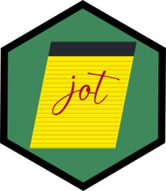

<!-- README.md is generated from README.Rmd. Please edit that file -->

```{r, include = FALSE}
knitr::opts_chunk$set(
  collapse = TRUE,
  comment = "#>",
  fig.path = "man/figures/README-",
  out.width = "100%"
)
```

# jot 

<!-- badges: start -->
[](https://github.com/christopherkenny/jot/actions/workflows/R-CMD-check.yaml)
<!-- badges: end -->

The goal of jot is to improve reproducability by allowing you to track statistics needed for an Rmd but are too big to open.
Some statistics require summarizing large datasets or take a long time to calculate.

`jot` approaches this with the following organizing principles:
1. Notes should be lockable, so that tests don't accidentally overwrite existing statistics.
2. We want to know when each statistic was last updated.
3. For collaborative projects, we want to know who last updated each statistic.
4. Records should play well with GitHub, which is done by representing notes as `yaml`.

## Installation

You can install the development version of `jot` like so:

``` r
remotes::install_github('christopherkenny/jot')
```

## Example

The normal workflow with jot is two staged, first is creating notes and second is reading them.


### To create notes:

First, we make a notepad, giving it a location and a title.
```{r example}
library(jot)

path <- tempfile(fileext = '.yaml')

jot_new_pad(pad = path, title = 'example')
```

The contents of the new pad will look like:

```{verbatim}
title: example
locked: FALSE
home: the_path.yaml
```

By creating a new notepad, we set it to be the active notepad. 
The active notepad is represented as a path.

```{r}
jot_active()
```

To write to the notepad can use `jot()`:

```{r}
jot(note = 3, name = 'estimate')
```

By default, it writes to the active notepad, which is now:

```{verbatim}
title: example
locked: no
home: the\path.yaml
estimate:
  last_update: 1659545779
  user: chris
  content: 3.0
  quoted: no
```

```{r}
jot(note = 4, name = 'estimate')
```

So, the notepad will still say:

```{verbatim}
title: example
locked: no
home: the\path.yaml
estimate:
  last_update: 1659545779
  user: chris
  content: 3.0
  quoted: no
```

We can fix that by explicitly overwriting.

```{r}
jot(note = 4, name = 'estimate', overwrite = TRUE)
```

This gives us:

```{verbatim}
title: example
locked: no
home: the\path.yaml
estimate:
  last_update: 1659545993
  user: chris
  content: 4.0
  quoted: no
```

We can add other values as long as they have a different name:

```{r}
jot(note = list(a = 1, b = 2, c = 3), name = 'list_abc', overwrite = TRUE)
```

We can even add fancier things like `data.frame`s, but this should be limited to small things!
The goal of `jot` is to store summaries and statistics, not all of your data.

```{r}
jot(data.frame(col1 = 1, col2 = 2, col3 = 3), 'df')
```

Once we're happy with the notes, we should lock the notepad.

```{r}
jot_lock()
```

This sets the locked value to TRUE (and yes in the `yaml`).

```{verbatim}
title: example
locked: yes
home: the\path.yaml
estimate:
  last_update: 1659545993
  user: chris
  content: 4.0
  quoted: no
list_abc:
  last_update: 1659546469
  user: chris
  content:
    a: 1.0
    b: 2.0
    c: 3.0
  quoted: no
```


### To read notes:

In the setup chunk for an Rmd, we add:
```{r}
library(jot)
jot_activate(pad = path)
```

Here, we use the same temp path that we were writing to above, but generally this should be something within the project.

Now, we can read out values.

We can skim the note and report back everything:

```{r}
jot_skim()
```
Or, we can select a specific element that we've stored.

```{r}
jot_read(name = 'estimate')
```

It returns the object of the same type as was inputted, so `list_abc` is a list:

```{r}
jot_read(name = 'list_abc')
```

